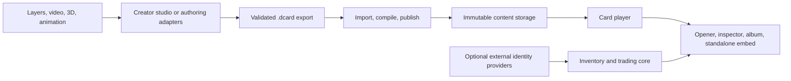

# Portable complex cards

**Runtime 0.1.0, 1 October 2026. The portable package, player, importer, creator APIs and studio are implemented. Start with the [runtime guide](runtime.md), [headless creator API](creator-api.md), [access model](../access-and-identity.md) and [verified coverage/limits](implementation-status.md). The larger specification remains a design roadmap.**

## The answer

Yes: a layered, interactive card can be saved as one file, imported into a website, displayed in an album, opened from a pack and traded as an owned copy. The website needs a compatible player, just as a video needs a video player. It does not need a separate custom webpage for every card.

Use a **`.dcard` bundle: ordinary ZIP, a small JSON card manifest, and established media formats**. This extension is our proposed application format, not an existing industry standard. Keep an editable project separately; export a compact, validated bundle for collectors. Import once into content storage and serve the needed assets individually at runtime.

The closest existing building blocks are glTF/GLB for 3D, including the ratified `KHR_interactivity` extension; Rive for interactive animation; and dotLottie for packaged vector animation. None of the reviewed standards supplies the entire card presentation, collection, host integration and performance contract we need. We should reuse those formats through adapters and define only the missing card contract. See the [research and sources](research.md).

## What this enables

| Creator idea | How it works |
| --- | --- |
| Our layered lakeside cards | Scene layers, local material effects and angle-driven tracks |
| A genuinely glittery petal | Flake/specular material clipped to the petal, with its own depth and response |
| A video playing on the back | Back-face video node, poster fallback, visibility-controlled decoder |
| A 3D creature inside a glass card | Optional glTF renderer adapter with a flattened fallback |
| A character that changes poses as you tilt | Registered animation frames driven by a seekable angle track |
| Two cards forming one panorama | A separate display assembly joins their coordinate systems |
| A card that changes with a game achievement | Typed, permitted host data input; server retains authority |
| A custom shader or tiny playable world | Host-installed renderer/effect adapter; optional isolated program profile |
| A blockchain-linked collectible | Optional identity/ownership adapter, independent of the presentation file |
| A different art style or completely rearranged site | Same contracts; replace assets, effects, UI and host composition |

## Recommended architecture

**One presentation can describe many owned copies.** Copy IDs, serials, ownership, secret codes, pack odds and trading rules live in the authoritative collection system. The presentation receives only the public inputs it needs. Downloading the bundle does not mint or transfer anything.

## Read the design

1. [Full specification](specification.md): package, scene model, effects, video, player, website integration, customization, security, identity and authoring.
2. [Implementation plan](implementation-plan.md): actual repository changes, milestones, migration of the current cards, acceptance gates and remaining decisions.
3. [Research](research.md): alternatives, primary sources, recommendations and their limits.
4. [Runtime API contracts](contracts.d.ts): key lifecycle and authoring types; concrete module documentation covers advanced adapters.
5. [Example presentation](examples/lakeside.card.json): art-free structural example with layered front and video back.
6. [Validation checklist](acceptance.md): required runtime, import, portability and real-device tests.

The example uses placeholder media references and hashes. It is not a distributable card and cannot render without real assets. The example checker verifies its internal references and contract shape, not media safety or a player implementation.

## First thing to build

Build one portable export of the existing lakeside card, one importer and one lifecycle-managed player. Render the same imported card in an inspector, a pack reveal and a different host layout without editing core code. Include a video back and run a sustained test on a physical iPhone before growing the editor or adding more engines.

The target is **one-click publishing for creators and one supported player contract for websites**. Complexity lives in reusable recipes, adapters and compilation rather than bespoke page scripts attached to every card.
