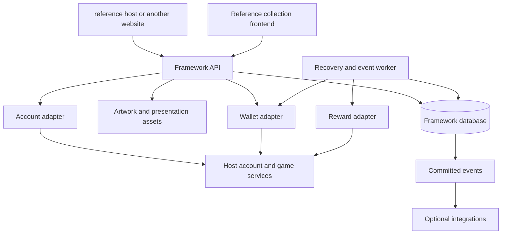

# Original design proposal

This preserved proposal predates runtime 0.1.0. See [current coverage](../implementation-status.md) and [runtime decisions](../adr-001-core-runtime.md) for implemented behavior. The original acceptance matrix describes broader future targets; it is not a test execution report.

# Art Card Pack Framework Specification

Version 1.0 design proposal · 30 September 2026 · Prepared for the reference host project and future framework adopters

**Latest confirmed architecture direction:** [Card-Framework-Product-Principles.md](../product-principles.md) takes precedence over host-specific wording in this proposal. The platform is open-ended by default and easy to connect through documented adapters: pack opening, collecting, albums, trading and future modules must work with unrelated card sets and host systems. Game accounts and configured currency below describe the first reference host integration, not universal core requirements. Trading is part of the intended product, with first-release timing undecided. Codes/rewards are optional examples of namespaced attributes and bindings; extension schemas, copy/definition scope, privacy, transfer and use lifecycles must be explicit. GPT/local-AI generation is an optional content-authoring workflow. These requirements are recorded for design; they are not a claim that the system is implemented.

This specification defines a reusable system for collecting digital art cards: sign in through a game account, purchase packs with the host server’s currency, open them, organize the cards into albums, and optionally redeem associated game rewards. reference host is the first intended integration. The framework must also run with a demonstration adapter and support other servers without changes to its core.

This is a specification for future implementation. It does not claim that purchases, cards, rewards, or adapters are implemented, tested, or deployed. Existing website authentication is useful integration groundwork; its existence does not establish that the economic integration is safe.

**Confirmed requirements** come from the project discussion. **Proposed defaults** resolve engineering choices so that implementation can proceed coherently after review. Example counts, prices, percentages, product names, and reward contents are illustrative and are not approved reference host economy settings. Requirements using **must** describe the intended acceptance contract for the proposed framework.

## 1 Product definition

**Development repositories:** Framework source and ongoing design are maintained in a dedicated Git repository and pushed to GitHub. Exclude artwork and game assets. Keep host-specific integration in a separate repository that consumes versioned framework contracts. Local roots: `DigitalCardFramework/` and `HostIntegration/`. Read [repository boundaries](../repository-boundaries.md); this proposal predates runtime implementation.

The product is a digital art collection platform with game account integration. Its main attraction is owning beautiful cards, discovering variants, completing collections, and arranging personal albums. A card can be valuable to its owner through its art, subject, treatment, provenance, or associated reward. No combat statistics are necessary.

The reusable distribution has four parts:

1. **Core service:** catalog publication, purchases, pack allocation, ownership, albums, entitlements, audit history, and recovery.
2. **Frontend kit:** storefront, pack opening, card inspection, collection, albums, account history, and operator interface.
3. **Integration adapters:** authentication, account eligibility, wallet operations, character lookup, and optional reward delivery.
4. **Content packages:** lines, artwork references, card definitions, visual treatments, pack rules, reward policies, translations, and official album layouts.

reference host supplies its branding, content, adapter configuration, and server-specific bridge. The generic core must contain no host-specific table names, password algorithms, item IDs, server addresses, or assumptions about configured currency credit versus prepaid balances.

### Confirmed scope

- Accounts use the host's identity provider; reference host ties them to an existing game account.
- Players purchase different types of packs using configured host-controlled currency or points; reference host uses configured currency.
- Lines organize artwork, products, opening presentation, and reward rules.
- Pack openings are polished and support rarity-specific presentation.
- Each acquired card copy persists and can be organized into virtual albums.
- Codes and prizes are optional and extensively configurable per line.
- Card definitions, variants and owned copies support validated namespaced attributes and module bindings; codes are one optional use.
- Trading belongs to the overall platform vision; launch timing and policies are separate choices.
- Plugins, adapters, and documentation are first-class parts of the distribution.
- Other developers can add a card game using documented identities and ownership interfaces.
- Desktop presentation primarily targets 16:9; mobile supports the complete collection and purchasing experience.

### Initial scope boundaries

The initial release does not implement a card battler, matchmaking, real-money checkout, cash-out, an NFT system, a trading marketplace, or Marvel Machine. Trading, duplicate conversion, achievements, and gameplay integrations have extension boundaries described below. They are separate delivery milestones, not hidden prerequisites for basic collecting.

**configured currency correction:** the host decides how players receive configured currency. There is no assumed unlimited free configured currency faucet or simulated checkout requirement. Prices must be chosen alongside the eventual allocation policy. The framework does not mint host currency as part of ordinary purchases.

### Success criteria

A server owner can install the demo, publish two differently configured lines, purchase and open packs, inspect exact transaction history, and install an example plugin using the documentation alone. A supported game adapter then replaces the demo providers without changing card, pack, or album logic. A player can complete every essential action on a phone and recover from interruptions without losing currency, cards, or rewards.

## 2 Terms and identities

| Term | Meaning |
| --- | --- |
| Installation | One independently operated deployment with its own authority and namespace. |
| Principal | A local framework account linked to an immutable subject from a trusted account provider. |
| Subject | The creature, place, person, or object depicted; an optional tagging relationship. |
| Line | A themed collection family with defaults for art direction, products, presentation, and rewards. |
| Release | An immutable published catalog edition within a line. |
| Card definition | A particular collectible design with a stable identity and checklist number. |
| Artwork revision | A specific asset composition and its metadata. |
| Variant | An obtainable treatment of a card definition, such as standard, foil, alternate art, or numbered edition. |
| Owned copy | One individually tracked instance of a variant belonging to a principal. |
| Pack product | An offering with a price, eligibility rules, collation rules, and presentation. |
| Pack instance | One purchased or granted pack with an immutable allocation of contents. |
| Allocation | The server’s committed selection of card copies and associated reward outcomes. |
| Entitlement | An authoritative right to claim a specific reward or choose from a fixed set of rewards. |
| Code | A secret credential that identifies a redemption route for an entitlement. |
| Finish | A rendering treatment, distinct from the underlying artwork and prize. |
| Official album | A checklist with defined completion rules. |
| Personal album | A player’s arrangement of references to owned copies. |

Internal IDs must be opaque, globally unique within the installation, and immutable. Public slugs and titles may change without breaking ownership. Recommended IDs are UUIDs generated with a platform cryptographic generator. IDs are identifiers, never authorization credentials. Imports preserve a content namespace and external ID mapping; they cannot silently overwrite another publisher’s definitions.

Use `(installation_id, provider_id, provider_subject)` as the account linkage identity. Usernames, emails, and character names are mutable display attributes. A single game account can own several characters without acquiring several card inventories.

A sleeping Slime, a night Slime, and a chibi Slime are separate cards if published as distinct designs. Sharing a subject tag does not merge them. A foil version of the same design may be a variant. An alternate composition with its own collectible identity should be a separate card, with an explicit relationship if desired.

## 3 Creative collection plan

The following directions preserve the owner’s requested themes. Final titles, launch order, and checklist sizes remain open.

| Direction | Visual identity | Collection opportunities |
| --- | --- | --- |
| Sleeping monsters | Serene forest scenes, dappled light, small environmental details, comfortable compositions. | Sleeping Slimes, mushrooms under leaves, resting creatures beside water; subtle firefly or dew finishes. |
| Places We Remember | Recognizable towns and iconic NPCs, warm familiarity, environmental storytelling. | Town vistas, shops, travel points, NPC portraits in context, panoramic pairs. |
| After Dark | Moonlight, fog, luminous eyes, lanterns, deep color and quiet tension. | Nighttime reinterpretations with restrained glow and selective foil. |
| Bosses | Scale, impact, unusual viewpoints, a strong sense of encounter. | Establishing scenes, portraits, phases as separate art identities when appropriate. |
| Victoria Island | A coherent journey through the region’s locations and creatures. | Location subsets and a complete regional checklist. |
| Orbis and El Nath | Cloud cities, stone, snow, cold atmosphere and travel between places. | An Ossyria-inspired collection with clearly named regional subsets. |
| Other regions | A shared regional-series identity with each place retaining its own palette. | Future content packages without changes to the schema. |
| Ludibrium | Clockwork, toys, impossible architecture and bright geometric motifs. | Die-cut-style frames, mechanical overlays, carefully restrained movement. |
| Aqua Road and Omega Sector | Deep sea and outer-space contrast. | One paired line with two subsets, or two related lines; owner decision required. |
| Weapons and equipment | Iconic objects rendered with care for silhouette, materials and memory. | Relics, weapon families, workshop scenes, object studies and display arrangements. |
| Chibi monsters | Playful proportions, expressive poses, clean compositions. | Sticker-like treatments, seasonal groups, illustrated mini-scenes. |

Line identity should come from composition, palette, frames, typography, pack wrapper, card back, and audio. Rarity alone should not determine whether the artwork looks finished. Common cards must be attractive enough to display.

**Proposed first production scope:** one line with 24 distinct artworks, three artwork rarity tiers, and a small subset demonstrating advanced finishes. This is a budgeting proposal, not a required number. A separate fictional demo line should prove configurable behavior without requiring additional host-specific art or a running game server.

Avoid making every artwork in every finish merely to inflate a checklist. Authors explicitly list allowed variants and decide which belong in base, finish, or master completion goals. A line can expand through a new release while keeping the original release’s checklist stable.

## 4 Recommended architecture

**Proposed implementation baseline:** a TypeScript modular service, PostgreSQL for authoritative framework state, a worker process from the same codebase, a React reference frontend, and a framework-independent HTTP client and event contract. The website can mount the reference frontend under a route or build its own interface against the API. The core does not require React or a particular hosting vendor.

These are recommendations for a new reusable package, not requirements to replace the existing reference host website backend. A service boundary lets the existing site authenticate users and mount collection pages while the new service owns card transactions. The game’s MariaDB remains under the game’s ownership.

Start with one service codebase and one framework database. A PostgreSQL outbox and job table are sufficient for initial asynchronous work. Redis, Kafka, Kubernetes, and separate microservices are optional future deployment choices, not mandatory installation dependencies. Asset storage can be a local directory in demo mode and an S3-compatible store or static host in production.



The framework database is the authority for card ownership and its transaction state. The host wallet is the authority for configured currency. The reward provider is the authority for actual delivered game items. Neither service infers completion from a browser animation or an HTTP timeout.

### Package boundaries

| Package | Responsibilities |
| --- | --- |
| `core` | Domain commands, state machines, validation and invariants. |
| `storage-postgres` | Transactions, migrations, constraints, jobs and outbox. |
| `http-api` | Authentication binding, authorization, request schemas, errors and OpenAPI. |
| `worker` | Reconciliation, delivery, event dispatch and scheduled expiry. |
| `sdk` | Typed client, retry guidance, receipt polling and integration examples. |
| `ui-react` | Reference routes and reusable components with theme tokens. |
| `card-renderer` | Static card composition and optional effects; no economic authority. |
| `adapter-sdk` | Account, wallet and reward contracts and conformance harness. |
| `adapter-demo` | Local fictional accounts, test currency, mock rewards and failure injection. |
| `adapter-reference-host` | Explicitly versioned server bridge and field mappings. |
| `content-tools` | Import, validation, simulation, asset checks and release publishing. |
| `plugin-sdk` | Versioned events, permission declarations and extension contracts. |

Every production artifact must be versioned, reproducible from source, and distributed with a lockfile and dependency notices. Select supported runtime and database versions at implementation kickoff; record them in the compatibility matrix and CI rather than promising every version.

## 5 Player experience

### Navigation and discovery

The reference UI provides **Card Shop**, **My Packs**, **My Collection**, **Albums**, and **Purchase History**. Reward access appears on relevant owned cards and through a **My Rewards** filter/page. Titles must be understandable without knowledge of the implementation.

A line page contains its artwork identity, description, release checklist, available products, pack composition, price and eligible wallet, duplicate policy, displayed odds, reward explanation, and retirement information where applicable. Visitors can browse a public catalog without signing in. Public catalog art can be watermarked or lower resolution according to the content package; that choice does not constitute access control over already downloaded images.

The interface shows useful empty states: no packs yet, no cards matching a filter, no published lines, temporarily unavailable wallet, no eligible character, and an album whose referenced card is no longer owned.

### Purchase flow

1. The player signs in through the host account flow.
2. They select a product and quantity and receive a short-lived server quote.
3. Confirmation shows the total configured currency, wallet type, pack size, odds link, duplicate policy, and whether rewards are possible. No real-money language is needed.
4. They confirm once. The client creates one durable request key and keeps it while recovering the result.
5. A receipt becomes completed, rejected, or processing. Processing is a visible recoverable state; it does not invite an immediate second purchase.
6. Completed packs appear in My Packs with **Open now** and **Open later**.

A refreshed balance is advisory until the wallet hold succeeds. The browser cannot choose the price, resulting cards, reward, or charged account. Automatic repeat purchasing is off by default. Quantity controls have documented server limits.

### Opening flow

Opening a pack means disclosing previously committed contents. A proposed normal sequence is a short wrapper interaction, a fan of card backs, individual reveals, and a summary with collection progress. The player can skip to the summary at any point after the result has loaded. A rare result may receive a distinctive reveal, but presentation must not imply that tapping speed or timing changes the outcome.

The first successful open request atomically makes the pack’s copies available in the collection. The response includes ordered presentation data, acquisition metadata, and reward state. If that response is lost, retry returns the same contents. Cards remain owned even when every image fails to load. The site can display text placeholders and retry asset delivery.

**Proposed duration targets:** ordinary pack presentation 5–12 seconds if played through; reveal-all response within one interaction; rare flourish no more than 3 additional seconds and always skippable. Players can select normal, quick, or reduced-motion presentation. Audio requires an explicit user interaction and a persistent mute preference.

“New” means first revealed ownership of the card definition, or of that variant when the player selects variant tracking. Compute this marker in the opening transaction and retain it in the original opening receipt. Replaying an opening preserves its historical labels and displays **Replay**. It never grants again or rerolls.

### Card inspection

The inspector offers front, back, zoom, title, line, collector number, art credit, variant/finish, serial where meaningful, acquisition source, and the owner’s reward status. Reward actions occupy a separate detail area; secrets are never printed into the reusable front image. Front/back motion must remain optional.

On 16:9 screens, the card and its details fit without forcing the art into a small modal. On mobile, the card uses available width and the details follow below. Essential actions require neither hover nor device motion. Avoid abrupt container resizing during reveal, filter changes, and reward state changes; reserve the card aspect ratio and predictable action area.

### Collection and albums

Collection filters include line, release, subject, rarity, finish, owned quantity, favorites, unclaimed rewards, missing definitions, and new acquisitions. Sorting includes collector number, title, acquired time, rarity order and quantity. Duplicate copies group by variant by default, with a copy drawer for individual entitlement and provenance differences.

An album is display organization. Moving a card to an album does not remove it from the collection. The same copy may appear in different personal albums. Within one album, the proposed default permits one placement per owned copy; a second physical-looking copy requires a second owned instance. Authors can choose a clearly labeled gallery mode that permits repeated display, but that mode never increases owned counts or completion.

## 6 Art production and card rendering

### Asset contract

Recommended working card ratio is 5:7, with a 1500×2100 pixel composite master and higher resolution source art where available. These are proposed production targets, not a claim about existing assets. Publish responsive derivatives such as 300×420, 600×840 and 1000×1400. An alternate ratio is supported through the line template if every layout and crop rule declares it.

Each artwork entry records source master, derivative hashes, color profile, crop/focal point, safe zones, creator credit, provenance, rights information, and optional masks or layers. Preserve source masters outside web delivery storage. Use sRGB exports for the reference web pipeline. Include enough background beyond the visible crop for limited tilt/parallax movement.

Text remains editable, localizable layout data. Generated art must not be the only source of card names, edition numbers, or reward descriptions. Use title-safe areas and typography designed for the art; choose a quiet background or intentional nameplate when contrast demands it. The artwork remains the focus.

### Supported material tiers

| Treatment | Required assets | Expected behavior |
| --- | --- | --- |
| Standard | Art and frame | Static, high-quality composition. |
| Gloss | Art plus generic highlight profile | A restrained reflection following pointer/touch inspection. |
| Holo | Art, authored foil texture and material profile | Moving color/reflection overlay; static fallback is intentionally composed. |
| Selective foil | Holo inputs plus a mask | Only selected objects or frame areas reflect. |
| Glitter | Particle/noise texture and mask/profile | Controlled sparkle with a low-intensity accessibility fallback. |
| Emissive | Art plus glow mask | Lanterns, eyes or magic emit a subtle effect. |
| Parallax | Prepared layers or depth data and crop padding | Limited depth movement without exposed cutout gaps. |
| Animated illustration | Authored animation/video or sprite assets | Real scene movement; pause and static poster supported. |

A single normal image can support convincing gloss, holo, and texture effects. It cannot automatically supply clean occluded scenery or accurate character animation. Depth cutouts, masks, and animation require additional asset work and review. Automated generation can assist, but a human should check halos, distorted silhouettes, and unnatural depth boundaries.

Each variant references a versioned renderer profile with parameter ranges. Content packages supply declarative settings and assets, not arbitrary scripts. Advanced renderer code ships through a separately reviewed frontend module. Effects cannot alter card identity or prize eligibility.

### Art quality gates

- Recognizable subject, coherent anatomy and object geometry, intentional composition, and no accidental lettering.
- Consistent line palette and frame grammar without making every image interchangeable.
- Readable title and metadata at normal viewing size, with zoom for detail.
- No asset clipping at maximum permitted tilt; masks align at every derivative size.
- Seamless static fallback, reduced motion, dark/light surrounding UI, and transparent layers.
- Credits and provenance accompany the card definition and survive exports.
- Thumbnail review across the entire checklist catches repetitive poses, near-duplicate images and weak common cards.

Example visual parameters belong to the asset package. No API should let user-supplied CSS, HTML, shader source, or remote arbitrary URLs run through card metadata.

## 7 Catalog lifecycle and configuration

A line moves through **draft**, **published**, **paused**, and **archived** operational states. A release is drafted, validated and published once; its economic contents then become immutable. Pausing a line stops new sales while preserving existing packs, cards and valid claims unless an explicit incident control separately suspends claims.

Publishing produces a normalized manifest, a semantic schema version, a content revision, hashes of referenced assets, and a canonical rules hash. Validate references, duplicate IDs, eligible variants, weights, required adapter capabilities, supply policy, reward configuration, localized labels and missing assets before publication.

Economic edits create a new product/release revision. Purchased packs retain their exact product revision and reward policy. Price changes invalidate outstanding quotes unless the operator explicitly supports honoring an older quote through its stated expiration. The proposed implementation rejects an old quote after product suspension or price revision and returns a new quote for confirmation.

Cosmetic corrections can update public display metadata through a documented revision chain. Fixing a misspelling is different from replacing collectible artwork. Proposed policy: text corrections update current display with history retained; substantial art replacement creates a new artwork revision and preserves access to the originally acquired presentation where distribution remains possible. Emergency asset withdrawal leaves an owned record, credit and explanation, with a placeholder if necessary.

### Effective policy resolution

At publication, compile inherited settings into a complete effective product configuration. Runtime purchases should not chase mutable defaults.

1. Installation settings establish hard limits and permitted capabilities.
2. Line defaults establish presentation and reward defaults.
3. Release settings provide the published catalog and allowed variants.
4. Product settings establish price, slots, odds and permitted reward policy.
5. Ordered reward rules select one applicable rule for each card copy.
6. Explicit variant/card overrides are compiled as higher-priority rules.

Conflicting rules with equal priority are validation errors. `disabled` explicitly suppresses rewards; an absent override inherits. V1 permits one entitlement per copy, whose reward may be a bundle. Multiple independent rewards should use a single declared bundle so that fulfillment semantics remain explicit.

## 8 Pack product and collation rules

A product declares its line/release, sale status, wallet, positive integer price, pack size, slots, allowed quantity, eligibility, limit scope, duplicate behavior, optional pity, presentation profile and reward policy. The first implementation supports products belonging to one line. Cross-line festival packs require a later schema extension with clear checklist and pity semantics.

Each slot group has a count and a weighted table. A table selects a pool; a pool selects a card or variant using its own positive integer weights. Conditional finish selection then resolves an explicit obtainable variant. A finish that has no variant for a selected card must be excluded by a declared eligibility rule, with the resulting odds disclosed; silent substitution is forbidden.

### Proposed baseline behavior

- Outcomes are allocated at purchase, before the pack is presented as completed.
- Packs can remain unopened indefinitely; ordinary unopened packs do not expire.
- Unopened pack contents are concealed from player APIs until opened.
- Within-pack duplicate definitions are prevented where the product explicitly enables that policy.
- Across-pack duplicates are allowed by default.
- Pity and collection-based duplicate protection are off unless a line enables and documents them.
- Uncapped editions are the initial recommended economic profile.
- Pack trading and gifting are off in V1.

Keeping purchased contents fixed avoids old packs changing when a catalog changes. Finite supply is reserved during purchase preparation and committed when payment completes. Pity advances on successful purchase allocation, not on when a player watches an animation.

### Exact selection order

For each serialized purchase in an account’s applicable pity/protection scope:

1. Load the immutable product snapshot and the current policy counters.
2. Establish eligible pools after account policy and finite-supply availability checks.
3. Apply an explicitly triggered pity replacement to its configured slot.
4. Process slot groups in declared order and positions in increasing order.
5. Apply duplicate exclusions to the candidate pools at the declared scope; apply the published empty-pool fallback if needed.
6. Select the pool using its remaining eligible weights, then the definition using its remaining eligible weights.
7. Select an eligible finish/variant using the selected card’s compiled finish table.
8. Reserve its edition capacity if capped; record the chosen result durably.
9. Evaluate reward eligibility and allocate any fixed/random prize or fixed choice set.
10. Record next policy counters, allocation trace and rule versions with the staged result.

The random source must be the operating system’s cryptographic generator. Map random values to bounded integer ranges without modulo bias. Statistical tests complement source review; they cannot establish cryptographic unpredictability. A deterministic injected generator is permitted only in test/demo configurations that cannot be enabled in production accidentally.

Duplicate policies must specify `definition` versus `variant`, `pack` versus `purchase`, and a fallback. The recommended unique-within-pack implementation removes already selected definitions from the eligible pool and renormalizes weights; it does not retry forever. A pool with no eligible entries must follow a published fallback or fail before capture. Validation must detect impossible all-unique products where feasible, and runtime must still handle changing finite supply.

For conditional odds caused by duplicate exclusions or finite availability, disclose the base table and the condition. Never advertise a fixed per-card probability that the algorithm does not preserve.

### Optional pity

V1 may support a simple hard guarantee: after `N−1` successful eligible packs without a qualifying result, the designated slot of pack `N` draws from a specified guarantee table. A qualifying ordinary draw resets the counter. Define the qualifying variants, scope `(account, line, policy_revision)`, which products participate, handling of grants, and whether additional slots count toward reset.

Batch purchases are processed as ordered individual packs. Their pity transitions are equivalent to purchasing the same packs one at a time. In-progress external payment for a scope blocks another allocation in that scope until reconciled. New policy revisions require an explicit counter migration or reset announcement. Soft pity, escalating odds, and user-specific arbitrary formulas are deferred extensions.

### Optional duplicate protection

If enabled, protection can prefer definitions never acquired in that release. Proposed semantics use acquisition history, including allocated sealed copies, so deletion, future trading, or repeatedly delaying openings cannot reset eligibility. Reveal UI only counts visible collection progress. When the protected pool is exhausted, use a disclosed normal pool. This changes probabilities and must be reflected in the product’s odds explanation and simulation.

## 9 Probability and economy design

There is no universally correct artwork count or rarity table. The host’s configured currency allocation pace, intended collection lifetime, duplicate tolerance, available artwork budget, and item rewards all affect the design. Operators must be able to model these together before publication.

**Illustrative configuration only:** a three-card pack draws two distinct Base definitions from a 12-card pool and one spotlight from six Gallery cards at 80%, four Showcase cards at 18%, or two Master cards at 2%. This uses 24 artworks. The pools are disjoint, with uniform weights inside each rarity. A particular Master therefore appears in 1% of these packs. The probability of at least one copy after 100 independent packs is `1 − 0.99^100`, approximately 63.4%; it is not guaranteed. The expected pack count for one particular Master is 100, with substantial variation.

An independent finish distribution could be 75% standard, 20% foil and 5% holo for every eligible selected card. Then the probability of at least one holo among three cards is `1 − 0.95^3 = 14.2625%`. Artwork rarity, finish rarity and prize odds must be shown separately. A top artwork with a top finish has the joint probability defined by the actual conditional tables, not either marginal probability alone.

The simulator must report expected copies, percentiles for first target and completion, duplicate proportions over time, finish completion, pity effects, finite supply exhaustion, and expected reward quantities per 1,000 packs. Include seedable reproducibility for simulation only. Report sample size and uncertainty when estimates come from simulation. Exact enumeration should validate small rule sets.

Economy review inputs include configured currency granted per player per week, pack price, activity differences, alternate-account rules, line availability, prize quantities and game progression impact. If average allocation is `A` configured currency/week and pack price is `P`, the simple budget is `A/P` packs/week before other configured currency spending. The framework supplies tools and reports; the host sets the policy.

Published odds must distinguish per slot, per card, per pack, and conditional guarantees. Avoid using “1 in N” as a promise of delivery by purchase N. Collection progress must distinguish base checklist completion from all variants and from capped cards unavailable to most players.

## 10 Authoritative data model

Use relational records for identities, ownership and economic state. JSON is appropriate for versioned policy documents and namespaced metadata; it must not replace foreign keys and uniqueness constraints protecting balances, allocations and claims.

| Entity | Important fields and constraints |
| --- | --- |
| `principals` | ID, provider subject, status, display alias, timestamps; unique provider linkage. |
| `lines` | Stable ID, namespace, slug, title, operational state, current release pointer. |
| `releases` | Line, version, normalized manifest, rules hash, published time; immutable after publish. |
| `card_definitions` | Stable catalog ID, owning line and identity relationships; independent of release membership. |
| `card_revisions` | Definition, immutable revision, name, rarity, subject tags and art reference. |
| `release_entries` | Release, card revision, checklist number and allowed variant revisions; unique checklist position. |
| `variants` | Definition, finish, renderer revision, supply policy, completion classification. |
| `asset_revisions` | Content hash, location, dimensions, media type, credit/provenance and fallback. |
| `product_revisions` | Line/release, effective slots, price, currency, eligibility, reward policy, rules hash. |
| `quotes` | Principal, product revision, quantity, total, expiry, capability/price revision. |
| `purchase_operations` | Principal, idempotency key, request hash, quote snapshot, state, external references. |
| `wallet_operations` | Purchase, hold/capture/release/refund IDs, request digest, provider state, last reconciliation. |
| `pack_instances` | Purchase or grant, product revision, ordinal, owner, allocation ID, sealed/opened state. |
| `allocation_entries` | Pack, slot ordinal, chosen variant, reserved supply, reward snapshot, selection trace. |
| `owned_copies` | Owner, variant, source allocation entry, acquisition time, visibility, state, serial, version. |
| `ownership_history` | Copy, previous/new principal, reason, operation reference; append-only. |
| `policy_counters` | Principal and policy scope, counter values, version, pending operation reference. |
| `edition_inventory` | Variant/edition, cap, reserved and issued counts; transactional checks. |
| `entitlements` | Copy, owner binding, immutable reward snapshot, expiry basis, status, version. |
| `claim_operations` | Entitlement, destination, selected option, state, idempotency key, provider receipt. |
| `delivery_components` | Claim component, provider operation ID, state and durable receipt. |
| `redemption_tokens` | Entitlement, token hash, encrypted display copy if needed, generation and revocation. |
| `albums` | Owner, title, visibility, share token, layout revision, optimistic concurrency version. |
| `album_slots` | Album/page/position, copy reference or explicit checklist target; unique position. |
| `favorites` | Principal and copy/definition according to feature, unique pair. |
| `outbox_events` | Event ID/type/version, aggregate/version, redacted payload, committed time. |
| `jobs` | Type, deduplication key, available time, lease, attempt count, last safe error. |
| `audit_events` | Actor, action, affected IDs, before/after hashes, reason, correlation ID and time. |

Use database timestamps in UTC with explicit units at integration boundaries. Store currency and quantities as integers; use sufficiently wide database types and decimal strings in JSON where values could exceed the client’s safe integer range. No floating-point configured currency arithmetic. Game adapters enforce their own narrower limits before accepting an operation.

Mandatory uniqueness includes one allocation per pack, one copy per allocation entry, one source entitlement per applicable copy/policy, one capture reference per purchase, one successful claim per entitlement, one provider operation ID per delivery component, and unique edition serial within its edition.

Purchase idempotency is scoped to principal and command. The same key with the same normalized payload returns the same operation; the same key with a different payload returns conflict. Economic operation identities and receipts must survive normal log retention. No background cleanup may remove the ability to detect a previously completed debit or delivery.

Database operations require explicit concurrency control. Lock relevant ownership/counter/supply rows in a documented order or use serializable transactions with bounded retry handling. PostgreSQL documents that serializable transactions can abort and must be retried; implementation must handle that outcome rather than assuming an isolation setting removes the need for recovery. [PostgreSQL transaction isolation](https://www.postgresql.org/docs/current/transaction-iso.html)

## 11 Purchase transaction and recovery

### Required invariants

1. One accepted purchase operation captures its specified configured currency amount at most once.
2. A completed purchase has exactly its purchased number of packs and their exact card counts.
3. Every completed pack has one durable allocation; opening cannot replace it.
4. A rejected unpaid purchase does not issue usable copies or consume committed pity progress.
5. A captured payment remains recoverable even if local finalization or the HTTP response fails.
6. An uncertain payment outcome never triggers a speculative second debit or a speculative refund.
7. Price, reward and catalog revisions used for the purchase remain identifiable permanently.
8. Wallet and provider receipts can be reconciled with local operations without relying on application logs alone.

There is no shared transaction spanning the framework database and an arbitrary game server. Use an explicit operation protocol with idempotent external commands and durable recovery. The initial supported wallet contract requires reservations. A provider that only exposes a non-idempotent `subtractBalance` method is insufficient for production acceptance.

### Wallet contract

| Method | Required semantics |
| --- | --- |
| `getBalance(subject, currency)` | Return available and held amounts, version and observation time. |
| `reserve(operationId, subject, currency, amount, requestHash)` | Atomically create one hold or return the existing matching result; enforce balance and eligibility. |
| `capture(operationId)` | Convert the existing hold into one debit exactly once in the provider’s durable ledger. |
| `release(operationId)` | Release an uncaptured hold once; report conflict if already captured. |
| `getOperation(operationId)` | Return durable state and receipt, including after restart and timeout. |
| `refund(refundId, originalCaptureId, amount, reason)` | Optional separately authorized, idempotent credit linked to a specific capture. |

Provider states are `not_found`, `held`, `captured`, `released`, `declined`, and `expired`. The provider must return a stable final state for completed operations. An adapter timeout is represented locally as unknown; it is not evidence of `not_found` or decline.

The proposed hold lease is renewable. Capture and expiry must be atomically ordered at the provider: exactly one can win. A capture retry after a confirmed expired hold cannot create a replacement debit. The framework starts a new purchase only through a new player-confirmed operation. Retain operation tombstones sufficiently to prevent delayed network retries from recreating an expired reservation.

### End to end purchase sequence

1. **Accept:** validate session, eligibility, quote, quantity and request digest. Insert a durable purchase in `created` state and its outbox/job record. Concurrent requests with the same key converge here.
2. **Reserve configured currency:** request the host hold with the purchase’s stable operation ID. Persist the confirmed provider receipt. An unknown outcome enters reconciliation.
3. **Prepare allocation:** under local concurrency control, acquire the account’s policy scope and required supply. Select and persist all pack outcomes, rewards, next counters and supply reservations in one transaction. The result is hidden and unusable. Store `allocation_prepared` before asking for capture.
4. **Capture configured currency:** call capture for the same host operation. If the answer is unknown, retain the staged allocation and supply reservation and show processing.
5. **Finalize:** once capture is confirmed, commit the staged copies as owned-but-sealed, packs as sealed, entitlements as sealed, supply as issued, and policy counters as advanced. Record purchase `completed` and committed events in the same database transaction.
6. **Respond:** return the receipt and My Packs links. If the response is lost, the client reads or retries the same operation.

Do not hold an SQL transaction open during a network call. Pending scope ownership is a durable lease/reference, guarded by operation version and worker fencing; expiry of a worker lease does not expire an economic operation. A replacement worker must query provider state before deciding what is safe.

If allocation preparation fails before capture, release the hold and reserve no new economic results. Preserve the error and original operation identity. If the hold release response is unknown, keep the operation in reconciliation. If capture succeeded, default recovery is to finalize the saved allocation. If a catastrophic validation problem prevents finalization, escalate to a documented compensation case with proof that copies remain unusable; do not quietly substitute other cards.

Supply and pity reservations cannot be abandoned while a capture outcome is unknown. This can temporarily block a product or an account’s policy scope; integrity takes precedence over accepting additional conflicting purchases. The UI should state that a previous purchase is processing and provide its receipt.

### Purchase states

| State | Meaning | Allowed next outcome |
| --- | --- | --- |
| `created` | Durable request accepted. | `funds_held`, `declined`, `reconciling`. |
| `funds_held` | Host reservation confirmed. | `allocation_prepared`, `releasing`, `reconciling`. |
| `allocation_prepared` | Hidden results and resource reservations persisted. | `capture_pending`, `releasing`. |
| `capture_pending` | Capture requested with stable operation ID. | `completed`, `reconciling`, `releasing` after confirmed no capture. |
| `reconciling` | External result not yet known; preserve prior phase. | Resume the appropriate confirmed phase. |
| `releasing` | Confirmed unpaid operation is releasing holds and local reservations. | `cancelled`, `reconciling`. |
| `completed` | Capture and all local ownership records confirmed. | Separate authorized reversal workflow only. |
| `declined` | Provider or policy rejected before capture. | Terminal. |
| `cancelled` | No capture occurred; all holds released or confirmed expired. | Terminal. |
| `attention_required` | Automated retries cannot resolve safely. | An audited operator command resumes reconciliation or compensation. |

`attention_required` is not permission to edit database rows manually. Operators select documented actions based on provider receipts. Every recovery command is itself idempotent and audited.

### Refunds and grants

V1 does not promise discretionary self-service pack refunds. An operator can reverse a completed transaction only if its copies, sealed packs and rewards can be frozen and no irreversible delivery or downstream action prevents compensation. Freeze first, confirm refund second, then finish the local reversal. If the refund outcome is unknown, frozen assets remain unavailable until reconciled. Record the original issuance and reversal; do not reuse an already issued serial number.

Automatic compensation is reserved for documented failure cases. A manual goodwill grant is a separate operation, not a rewritten purchase. It records operator, reason, quantity, source policy and whether supply/pity are affected. Proposed default: grants consume edition capacity, do not advance pity, and are labeled in provenance. Administrative grants must never bypass finite caps unless the operator creates a separately identified edition.

## 12 Account and reference host integration

### Account provider

The reference integration uses the host’s existing authenticated session or a short-lived signed account assertion exchanged through a backend channel. Validate issuer, audience, subject, expiration, nonce and signature. Bind any login redirect to an allowlisted origin and a single-use state value. Never accept a browser-provided account ID as proof of account ownership.

The card framework should not store a second copy of the game password or independently reimplement the host’s password hash. If a host has no suitable authentication endpoint, its adapter may supply a documented login bridge, while the core receives only the established identity. Account linking requires proof of both accounts; matching a username or email is insufficient.

The adapter exposes account state, permitted currencies, optional characters and relevant eligibility flags. It must define behavior when the game account is banned, deleted, renamed or temporarily unavailable. Proposed default: banned accounts cannot purchase or claim; private collection access follows the host’s account policy. Deleted characters do not delete account-owned cards. Delinking cannot migrate cards to another account silently.

Use secure session cookies, explicit CSRF protection for cookie-authenticated writes, session renewal and revocation, account-level authorization on every resource, and recent authentication for sensitive linking or token reveal operations. Authentication errors should not disclose account existence, and throttling should be implemented at the appropriate account and network scopes. These controls align with the general guidance in the [OWASP Authentication Cheat Sheet](https://cheatsheetseries.owasp.org/cheatsheets/Authentication_Cheat_Sheet.html).

### Required host bridge

The reference host wallet adapter must introduce a durable configured currency operation ledger and account-scoped serialization shared with game spending and configured currency grants. It must also coordinate cached balance reads, updates and saves. Acceptable designs include moving all configured currency mutations through one wallet service or implementing a durable account-level operation authority with versioned cache updates and stale-save rejection. The engineering review must choose one design and demonstrate that every configured currency writer follows it.

Logging out a character is not sufficient synchronization unless the server enforces an account lease across login, all channels, offline operations and saves. A database-only adapter must advertise itself as demo/unsupported until this enforcement is verified. An “offline purchases only” mode is acceptable only with a durable server-recognized account lock, a fresh flush, and a release protocol that excludes simultaneous login.

The first bridge must test game spending, website spending, grants, channel changes, cash shop entry/exit, autosave, logout, reconnect and process crash against the same balance. Disable pack purchases if the bridge cannot establish safe authority.

For item rewards, prefer a durable account delivery inbox in the game service. The framework submits a unique delivery command; the host records it once and lets an eligible character collect the contents safely. Distinguish **available in game inbox** from **collected by character**. If the host instead grants directly to character inventory, it must provide an equivalent durable deduplication ledger and transactional item persistence.

Legacy redemption providers must declare token length and format constraints. Validate compatibility before enabling a provider.

### Adapter capability declaration

| Capability | Required for |
| --- | --- |
| `identity.verify` | All authenticated ownership. |
| `identity.status` | Purchase and claim eligibility checks. |
| `wallet.balance` | configured currency display and purchase preparation. |
| `wallet.reserve`, `wallet.capture`, `wallet.release`, `wallet.lookup` | Production pack sales. |
| `wallet.refund` | Automated or operator-controlled compensation that credits configured currency. |
| `characters.list`, `characters.verifyOwner` | Character-specific claims. |
| `rewards.validate`, `rewards.deliver`, `rewards.lookup` | Optional game reward lines. |
| `rewards.inbox` | Account delivery inbox presentation. |
| `coupons.ownerBound`, `coupons.redeem` | Codes entered through a supported game flow. |
| `wallet.cacheCoherent` | Acceptance of the reference host live adapter. |

Publication rejects a product requiring unsupported capabilities. Reward-disabled lines remain usable with identity and wallet support. A content preview can render without any economic adapters.

## 13 Rewards and codes

### Reward definition and allocation

Reward rules apply per line with the compiled overrides described earlier. Each rule declares eligibility, occurrence probability, reward selection, claim mode, account/character binding, expiry and transfer policy. Valid outcomes are:

- **None:** no entitlement exists.
- **Fixed:** one specified reward descriptor.
- **Weighted:** select one reward descriptor from a weighted pool when the card is allocated.
- **Bundle:** a fixed list of components with explicit quantities and fulfillment semantics.
- **Choice:** one option from a fixed, snapshotted list selected by the owner at claim time.

V1 permits a weighted pool entry to resolve to a fixed bundle. It does not permit arbitrary recursive random/choice trees. A choice list may contain fixed bundles; each option is fully displayed before confirmation. Bound nesting and component counts in the schema.

A reward descriptor contains a provider namespace, catalog item reference, quantity, permitted target, bind/trade flags, optional expiration and versioned provider metadata. The core does not interpret host item IDs. The adapter validates IDs, item properties, quantities, inventory category, stack limits and availability before publication. Claims revalidate conditions that can change, such as character eligibility and inventory space, without rerolling the prize.

Allocate random prizes with the card’s purchase result. A later configuration change cannot turn an already won reward into a different item. Choice options are fixed at allocation; the player’s one-time selection is then persisted before delivery. Changing a character after an ambiguous delivery is prohibited until the original outcome is resolved.

### Entitlement lifecycle

| State | Behavior |
| --- | --- |
| `sealed` | Allocated with an unopened pack; inaccessible to the player. |
| `available` | Opened and eligible to claim, or awaiting an explicit choice. |
| `claim_pending` | Claim locked and submitted; repeat requests return the same operation. |
| `available_in_inbox` | Provider durably delivered to an account inbox; character collection may remain. |
| `redeemed` | Provider confirms the required final delivery state. |
| `expired` | Claim window ended before an accepted claim. |
| `revoked` | Audited administrative revocation with reason. |
| `attention_required` | Delivery needs reconciliation; cannot be claimed again meanwhile. |

An entitlement without an expiry never expires implicitly when its line is archived. Proposed default is no expiry. If an expiry is configured, declare whether it is an absolute time, time since acquisition, or time since first opening. Since-opening expiry permits indefinite unopened storage and must be an intentional operator choice. Display the actual expiration as soon as determinable. A claim accepted before expiration remains valid while delivery is pending; expiry cannot win against a claim that already acquired the entitlement lock.

The card remains owned after redemption. Its collection tile may show a restrained claimed indicator; its details show the complete status and receipt. No reward status is conveyed by color alone. Public album pages omit private reward status by default; sharing it is a separate explicit option that can reveal only a coarse badge, never a usable token.

### Claim sequence

1. Verify principal, current ownership, account eligibility, entitlement state, expiry and destination ownership.
2. Validate a selected choice against the stored choice set and an allowed target against the adapter.
3. In one transaction, lock the entitlement, store choice/destination, create the claim operation and enqueue delivery.
4. Call the provider with a stable delivery ID and payload digest.
5. On confirmed durable acceptance, store the provider receipt and appropriate state. On timeout, query that same delivery ID.
6. Update the UI from authoritative state; polling or push notifications merely transport it.

The provider must guarantee that repeating a delivery ID with the same payload cannot issue more items; repeating it with a different payload is a conflict. A read-before-write check alone is insufficient under concurrency. Exactly-once game effects are possible only when the host persistently enforces that contract. Otherwise the adapter cannot be accepted for production rewards.

Inventory-full and character-offline responses are recoverable conditions. Prefer the inbox so players can claim without synchronizing a live character session. For direct inventory delivery, wait and retry or allow a target change only after the provider proves no component was delivered.

Bundles require either an atomic provider delivery or per-component durable receipts. Partial bundles display partial fulfillment and retry only the missing components. Never repeat the entire bundle blindly. An irrecoverable removed item remains a support case; substitution requires an explicit recorded decision and, where the promised reward changes materially, player acceptance through a new claim choice.

### Code semantics

A code is one access route to an entitlement. It is not the inventory item or proof of card ownership. Website claims and in-game code entry must converge on the same claim operation and lock, so using both at once cannot double-redeem.

**Proposed default:** account-bound entitlements, with direct website claim when supported and optional in-game code entry. Code issuance can be lazy on first reveal; there is no need to pre-generate vast batches. Each reward-bearing copy receives at most one active code generation. Code reveal is authenticated, separately rate-limited, not cached and audited without recording the secret.

For the generic profile, generate at least 128 bits of cryptographic entropy, encode in a human-readable form and allow display separators. For the existing 17-character coupon field, a compatibility profile can use 16 uniformly random Crockford Base32 characters plus one checksum character: 80 random bits, with the checksum adding error detection but no entropy. That profile requires owner binding, throttling and explicit acceptance of its shorter token space. A future bridge can accept longer tokens. Do not claim 128-bit strength for the shorter profile.

Store a keyed hash for lookup and verification, with a key version. If the UI must display the same code again, store an encrypted copy using a separate managed encryption key. Restrict decryption to the reveal route. If encrypted display storage is omitted, show a newly issued code once and use an explicit revoke-and-reissue workflow for lost tokens. Reissue must invalidate the old generation before activating the new one.

Normalize case and separators consistently; reject invalid length and alphabet before expensive work. Codes must never encode account IDs, card numbers, item IDs or timestamps in a predictable way. They must not appear in URLs, analytics, exception messages, public exports, album screenshots, or normal logs. Clipboard copying is deliberate; never auto-copy on opening.

Imported third-party code inventories are a later provider module. Such a module needs encrypted storage, supplier provenance, exhausted-stock behavior and redemption verification. It cannot assume that displaying a code proves it was redeemed. Existing scan images and their printed codes are not a valid reward inventory.

### Future transfer policy

V1 cards and packs are account-bound. The schema stores a transfer policy so a future trading module can distinguish art-only transfers, transfers with unused entitlements, and permanently bound rewards. A revealed token cannot simply follow a traded card unchanged. Before transfer, revoke the old generation atomically, transfer entitlement ownership if allowed, and issue a new generation to the new owner. Reject transfers while a claim is pending or provider state is unknown.

## 14 Collection and album rules

Owned copies support `active`, `reserved`, `frozen` and `reversed` lifecycle states, separately from whether their pack is sealed. A future disposal module may add a terminal `consumed` state. Ownership history is append-only. Operators correct mistakes through commands producing new history, not silent row reassignment.

Official album slots reference a definition or a configured variant group. A base checklist slot is satisfied by any eligible owned revealed variant; a foil checklist has a different rule. Completion counts distinct satisfied targets, not total copies. Exclude optional promo, capped and secret subsets from base completion unless the album explicitly includes them. Hidden cards may have silhouettes or concealed names, but odds disclosure still describes their pool honestly.

Personal albums support title, cover, pages, slot layout, optional captions and ordering. Proposed layouts are 2×2, 3×3 and a full-art display page, with responsive presentation. A mobile single-column inspector may browse a page without shrinking all nine cards to illegible thumbnails. Drag and drop is supplemented by keyboard and touch-friendly **Move to** controls.

Album edits use an expected version or ETag. Concurrent edits return a conflict with the current version; do not overwrite another device’s arrangement silently. Reordering operations address stable slot IDs. Validate ownership when placing a copy and again when projecting an album. Future transferred or consumed copies leave a clearly marked empty slot or are removed according to the owner’s preference.

Visibility modes are private, unlisted and public. Default is private. Unlisted links use an unguessable share token that can be rotated or revoked. Public projection uses an explicit allowlist: public alias, approved album text, catalog data, card images and permitted collector metadata. It excludes account identifiers, acquisition financial details, code hashes/tokens, private notes and character information.

Album text is plain text or a narrowly sanitized format. No arbitrary HTML or external tracking images. Publishing and unpublishing must invalidate caches. An album export contains layout and catalog references; importing it cannot mint ownership. Missing owned copies become empty template positions.

## 15 API contract

The implementation must ship a generated OpenAPI document, request/response examples and a typed client. This section fixes the required resources and command semantics; exact serialization definitions are to be implemented from these contracts and tested for compatibility.

Use `/api/v1`. IDs are opaque strings; money is an integer decimal string plus currency identifier. All modifying economic commands accept `Idempotency-Key`. Authenticated response bodies containing secrets or balances use `Cache-Control: no-store`. Catalog assets and immutable public manifests may use content hashes and long-lived caching.

| Method and route | Purpose |
| --- | --- |
| `GET /capabilities` | Public feature availability without exposing internal secrets or topology. |
| `GET /lines` and `/lines/{id}` | Browse published lines. |
| `GET /releases/{id}/checklist` | Catalog and completion definitions. |
| `GET /products/{id}` | Current sale revision, composition, price and odds. |
| `GET /me` | Verified principal projection and permitted actions. |
| `GET /me/wallets` | Provider balances with observation time and availability. |
| `POST /quotes` | Validate product, quantity and eligibility; return an expiring quote. |
| `POST /purchases` | Accept quote and start one durable purchase. |
| `GET /purchases/{id}` | Read receipt, progress and safe recovery status. |
| `GET /me/purchases` | Cursor-paginated purchase history. |
| `GET /me/packs` | List owned sealed and opened packs. |
| `POST /packs/{id}/open` | Reveal the fixed allocation; return the same result on repeats. |
| `GET /packs/{id}/opening` | Read a previously opened result for replay. |
| `GET /me/cards` and `/me/cards/{copyId}` | Search ownership and inspect a copy. |
| `PUT /me/cards/{copyId}/favorite` | Set an explicit favorite value idempotently. |
| `GET /me/rewards` | Filter owned entitlements and delivery history. |
| `POST /entitlements/{id}/claims` | Commit a choice/target and start delivery. |
| `GET /claims/{id}` | Read claim and component receipts. |
| `POST /entitlements/{id}/code-reveal` | Authenticated issuance/reveal under configured policy. |
| `GET /me/characters` | Eligible destinations from the adapter. |
| `POST /albums` and `GET /me/albums` | Create and list albums. |
| `GET /albums/{id}` and `PATCH /albums/{id}` | Authorized album access and versioned edits. |
| `POST /albums/{id}/sharing` | Set visibility, issue or rotate sharing token. |
| `GET /shared/albums/{token}` | Allowlisted public projection only. |
| `GET /operations/{id}` | Poll a long-running authorized command. |

Game-to-framework redemption endpoints are separately authenticated service routes, outside the public cookie session API. Administrative endpoints live under `/admin/v1` with explicit role permissions. Disabling a frontend button is never access control.

### Purchase example

```json
{
  "quoteId": "quote_demo_01",
  "clientContext": { "locale": "en", "returnRoute": "/cards/packs" }
}
```

The quote already determines product revision, principal, amount and quantity. The request does not carry authoritative price or selected cards. `returnRoute` is an allowlisted local navigation hint.

```json
{
  "purchaseId": "purchase_demo_01",
  "status": "processing",
  "amount": { "currency": "host:configured currency", "value": "1000" },
  "quantity": 1,
  "productRevision": "sleeping-forest-demo@1",
  "rulesHash": "sha256:example-only",
  "statusUrl": "/api/v1/purchases/purchase_demo_01",
  "retryAfterSeconds": 2
}
```

This price and identifier format are illustrative. A production rules hash must be real. The final receipt adds pack IDs, a safe host receipt reference and completion time; sealed outcomes are not included.

### Error and concurrency behavior

Use a consistent error object containing stable `code`, safe `message`, `correlationId`, `retryable`, and optional `operationId`/`fieldErrors`. Codes include `QUOTE_EXPIRED`, `PRICE_CHANGED`, `INSUFFICIENT_FUNDS`, `ACCOUNT_INELIGIBLE`, `PRODUCT_PAUSED`, `CAPABILITY_MISSING`, `PURCHASE_PENDING`, `IDEMPOTENCY_CONFLICT`, `ALBUM_VERSION_CONFLICT`, `REWARD_EXPIRED`, `INVENTORY_FULL`, and `PROVIDER_UNAVAILABLE`.

Use 401 for missing authentication, 403 for forbidden operations, 404 for inaccessible individual resources where existence must be concealed, 409 for conflicts, 422 for invalid configurations, 429 for rate limits and 503 for unavailability. Return 202 when an operation was durably accepted but is pending. A transport-level error after acceptance does not mean failure; the client recovers by its original key or operation lookup.

Pagination is cursor-based with a stable tie-breaker such as acquisition time plus ID. Document sort direction, cursor invalidation and maximum page size. Mutating resource versions prevent stale album/administrative edits. Economic transitions use compare-and-set state checks under database concurrency control.

### Event delivery

Core events include `purchase.completed`, `pack.opened`, `card.acquired`, `entitlement.available`, `claim.delivered`, `album.published`, and `catalog.published`. Events carry event ID, schema version, aggregate ID/version, occurrence time and correlation ID. Event payloads never contain code secrets or raw account credentials.

Events are created in the same local transaction as their state change and dispatched after commit. Delivery is at least once; consumers must deduplicate by event ID. Per-aggregate sequence is available, but consumers cannot assume global event ordering. Webhooks use authenticated signatures, timestamps and replay protection, with retry/backoff and dead-letter inspection. A plugin failure does not roll back an already completed purchase.

## 16 Plugin and modification framework

Support declarative content packages and server integrations before permitting arbitrary economic hooks. A backend plugin declares ID, version, compatible core API range, dependencies, configuration schema, required permissions, subscribed event versions and its migration namespace. Installation is an operator action; players cannot upload executable plugins.

### Extension categories

| Category | Examples | Authority |
| --- | --- | --- |
| Content package | New line, frame, wrapper, translations and checklists. | Validated declarations only. |
| Adapter | Different identity system, wallet or game delivery provider. | Explicit capabilities and conformance tests. |
| Event integration | Discord-style announcements, analytics, achievement tracking. | Receives redacted committed events and scoped APIs. |
| Collection module | Duplicate recipes, album challenges, trade offers. | Calls core reservation and ownership commands. |
| Presentation module | New reveal choreography or foil renderer. | Changes visuals; cannot award ownership. |
| Gameplay module | Card-battler definitions and match inventory validation. | Reads catalog/ownership and requests scoped reservations. |

Plugins must use namespaced extension metadata such as `example.battler.stats`. The core treats it as versioned data with size limits and schema ownership. A third-party game can assign stats to stable card IDs without changing the original artwork catalog or requiring core combat rules.

### Economic extension boundary

Core owns minting, transfer, consumption, entitlement state and balances. Plugins submit typed commands with an actor, reason, idempotency key and declared permission. A plugin cannot grant a card by writing an arbitrary collection entry or by returning a browser event.

Pre-transaction validation hooks must be bounded and deterministic over a provided snapshot. They cannot perform unbounded network requests under database locks. V1 should prefer declarative eligibility rules; arbitrary custom collation code is deferred until its determinism, versioning and odds disclosure can be enforced. After-commit hooks cannot alter the already committed allocation.

In-process code has the process’s privileges; permission declarations alone do not sandbox it. Only trusted reviewed adapters/core modules run in process. Less trusted integrations run as separate services using scoped credentials and authenticated webhooks. Document this trust model plainly.

### Reservations for future modules

A core reservation API locks specific owned copies for a named operation and purpose, records expiry and version, and prevents conflicting claim/transfer/consume commands. Expiration is safe only when no external side effect is uncertain. Completing a reservation requires the authorized operation ID and expected versions. An observer event never supplies authority to consume another player’s cards.

Trading would use offers, both-party acceptance, revalidation and one atomic ownership swap. Duplicate conversion would reserve all inputs and atomically consume them while minting the defined output. Cards with pending claims are ineligible. Favorited or album-displayed cards require clear handling and a confirmation flow. These modules should be documented as future designs until implemented and tested.

### Lifecycle and compatibility

Plugin install and upgrade validate compatibility before migrations run. Migrations are isolated to the plugin’s schema/namespace and cannot edit core tables. Uninstall disables callbacks and preserves required historical data; it does not delete cards or reward receipts. A line depending on an unavailable renderer falls back to static art. A line depending on an unavailable economic provider stops new sales and preserves recovery access.

Include a reference plugin that listens to `pack.opened`, maintains a private collection milestone counter, and displays a non-economic badge through a permitted extension slot. This proves installation, events, deduplication, migration and UI integration without creating another currency system.

## 17 Operator tools

The administrative interface is part of the product. Operators must not need SQL edits to publish content or resolve ordinary interrupted operations.

### Content workflow

1. Create a line from a template or import a content package.
2. Upload assets and validate dimensions, hashes, masks and provenance.
3. Define card/variant checklists and completion groups.
4. Configure products, odds, currency mapping and reward policies.
5. Run deterministic validation and simulation; inspect the player-facing odds page.
6. Preview cards, pack openings, mobile layouts and reward states with test identities.
7. Publish an immutable revision and choose sale availability.
8. Pause, replace sale products or archive the line through explicit actions.

Asset import rejects archive traversal, excessive expanded size, malformed images, scripts and unsupported media. Content package import never executes a build script. A dry-run report lists new IDs, changed drafts, conflicts, absent dependencies and required capabilities. Publishing cannot silently resolve ID collisions.

### Operations console

Provide searches by safe account reference, purchase ID, pack ID, copy ID, claim ID and provider operation ID. Show a timeline of state transitions, immutable product snapshot, safe external receipt and outstanding recovery work. Do not display decrypted codes in ordinary support search results.

Controls include pause sales, pause claims, pause a specific product/provider, reconcile an operation, retry a proven safe delivery, release a proven uncaptured hold, freeze an account’s economic actions, grant a pack with a reason, and initiate a qualified reversal. Each action has a clearly stated consequence and permission requirement.

Proposed roles are content editor, publisher, support reader, transaction operator and installation administrator. Small installations may combine roles; permissions remain separately defined. Require stronger authentication for publishing, grants, refunds, token access and integration secret changes. Audit actor, reason, command and affected records. Optional second-person approval is an operator policy, not a mandatory obstacle for every private-server deployment.

Support tools cannot choose a new random result for a completed purchase. Correcting a mistake uses a new adjustment or grant with visible provenance. Audits distinguish test grants from production circulation.

## 18 Security and abuse requirements

The principal threats are forged ownership, repeated debits/grants, concurrent spending, account takeover, leaked reward codes, malicious content packages, compromised plugins and support actions that bypass invariants. Controls should be implemented around these concrete paths.

- Authorize each requested resource by the authenticated principal and current state. Test cross-account access to packs, copies, albums, claims and receipts.
- Keep host service credentials out of browsers. Use separate least-privilege credentials for identity, wallet and reward operations where practical.
- Authenticate server-to-server commands; include payload digests and replay-safe operation identities. Prefer TLS and a private network or authenticated gateway.
- Rate-limit login, quote, purchase, opening, code reveal, code entry and sharing operations independently. Set initial limits as documented deployment configuration and adjust using observed legitimate traffic.
- Validate all quantities and integer bounds. Reject negative prices, overflowing multiplication, unknown currencies and forged product snapshots.
- Reject client-submitted rarity, selected reward, owner or balance fields outside their allowed command schema.
- Sanitize album text, credits and imported metadata; enforce content security policy on the reference frontend.
- Avoid remote URL fetching during request processing. Any importer fetcher must allowlist sources and prevent access to local/private network endpoints.
- Redact authentication material and token secrets from logs, tracing, analytics and error reports.
- Separate demo and production configuration, credentials, origins and data. Demo currency must be visibly labeled and never use live account bindings.
- Keep key rotation and backup procedures for signing, token hashing and encrypted token display. Retain old key versions only as needed to read valid records and migrate safely.
- Treat banned accounts, alternate-account limits and bot behavior as host policies with defined inputs. Avoid inventing device fingerprinting as a prerequisite.

Ownership APIs should not expose private player inventories to arbitrary plugins or public catalog consumers. A future game obtains owner-authorized access with restricted scopes and duration. Public album access grants no right to mint or transfer its cards.

Asset rights and code licenses are tracked separately. A reusable framework release should include original or clearly redistributable demonstration art. domain-specific packages can be separately supplied by an operator under the permissions applicable to their assets; do not label a software license as granting rights to unrelated art, names or audio.

## 19 Performance and accessibility

The following are proposed acceptance targets, to be measured on a declared reference environment during implementation. They are not claims about current performance.

| Area | Proposed target |
| --- | --- |
| Cached catalog response | p95 under 250 ms at the service boundary. |
| Collection query | p95 under 500 ms with 10,000 owned copies per test account and indexed filters. |
| Economic request acceptance | p95 under 1 second excluding an explicitly pending provider operation. |
| Healthy adapter purchase | p95 completed within 3 seconds under the reference workload. |
| Open an allocated pack | p95 authoritative response under 500 ms; asset loading reported separately. |
| Desktop animation | Aim for 60 fps on the declared reference machine; graceful quality reduction. |
| Mobile presentation | Smooth interaction on a declared midrange phone, with no required WebGL or device motion. |
| Initial collection route | Proposed compressed JavaScript budget under 300 KB before optional effect modules; measure and revise explicitly. |
| Active effects | Animate only visible/inspected cards; pause offscreen and background-tab work. |

Reference capacity testing should begin with 1,000 simultaneous browsing sessions, 20 purchase commands/second and 50 opening commands/second, using a documented simulator and test data. These are engineering test targets rather than promised production capacity. Report machine specifications, database size, cache state, connection limits and provider latency. External game capacity may require lower configured purchase concurrency.

Use responsive image derivatives and lazy-load below-fold art. The collection grid renders static thumbnails; full effects load for selected cards. Keep shaders/video optional. Detect reduced motion and provide a persistent effects setting. A static card must still look intentional.

Essential requirements include keyboard navigation, visible focus, screen-reader labels, adequate contrast, meaningful alt text, non-color reward/rarity labels, scalable text, no rapid flashing and explicit audio controls. Touch targets should be at least 44 CSS pixels in the reference design. Test 1920×1080 and 2560×1440 desktop layouts, 390×844 mobile, a narrow 320-pixel viewport, and 200% text zoom. Use portrait and landscape mobile tests for opening/inspection.

A card’s accessible description names the subject, title, rarity and finish without automatically reading every decorative particle. Announce a reveal summary rather than flooding the screen reader with animation events. Opening and album organization must be possible with animations disabled.

## 20 Deployment and operations

Ship a local demo profile and a documented production profile. The demo includes fictional sample cards, demonstration currency, mock login, mock rewards and controlled failure injection. It must work without host-specific assets, a game database, external paid services or private credentials.

The proposed production topology is reverse proxy/TLS, API, worker, PostgreSQL and asset storage. Use separate credentials and network boundaries for the game bridge. Environment configuration names every external origin, provider, secret source, asset root, allowed currency and feature flag. There must be no dependency on a developer’s Windows path or personal host address.

Database migrations require backups, explicit compatible version ranges and a tested rollout process. Use backward-compatible transitions when API and worker versions can overlap. Migration startup checks prevent an old worker from processing new incompatible jobs. Rollback instructions must distinguish application rollback from irreversible data migration; never suggest restoring only the framework database after live external debits without reconciliation.

### Backup and restoration

Back up the framework database, immutable content manifests, original asset references, durable provider ledgers and encryption key material under separate access controls. A database backup without the keys required for retained token ciphertext is incomplete. Preserve encryption keys through rotation and restoration.

Restoring a stale framework snapshot against a newer game wallet can otherwise repeat or lose operations. Recovery must reconcile all external operation IDs after the backup boundary, rebuild missing local receipts where supported, and freeze uncertain economic activity until complete. The provider’s durable deduplication history must outlive the recovery window. Perform a coordinated restore drill before production acceptance.

Proposed operational targets are a 15-minute backup recovery point and a four-hour restore objective for the initial supported deployment, subject to the host’s infrastructure. Economic reconciliation can extend maintenance time when outside systems are unavailable. Measure these targets in a rehearsal; do not treat a configured backup job as proof of recoverability.

### Monitoring and incident handling

Track purchase completion/decline/unknown counts, age of pending holds, provider latency, recovery backlog, delivery retries, duplicate-operation attempts, supply consistency, policy counter conflicts and asset failures. Logs carry correlation IDs and safe operation identifiers. Alerts should focus on stuck economic work and invariant violations, not every transient retry.

Supply totals, issued copies, reversals and reservations must reconcile. Wallet captured totals must reconcile to completed or explicitly compensating purchases. Each delivered entitlement must have a provider receipt. A daily reconciliation job produces actionable discrepancies without modifying uncertain records automatically.

Incident controls can pause sales independently from browsing, opening already paid packs, and claims. For example, a wallet outage should preserve collection browsing. A delivery outage can pause claims while paid art-only products remain available if their capabilities are healthy. The operator policy must define these boundaries before launch.

Data retention must distinguish removable telemetry from required transaction provenance. Account deletion can remove public aliases, sharing links and personal album text while retaining the minimum pseudonymous economic records needed to prevent replay and support the host’s obligations. Specify a deployment policy before production rather than inventing a universal retention period.

## 21 Reuse plan and license review

Existing repositories provide useful bounded components, but none inspected so far supplies the complete host-wallet, ownership and reward protocol specified here. Previous research inspected documentation and selected source; it did not install or integration-test these projects.

| Candidate | Proposed use | Important boundary |
| --- | --- | --- |
| [Draftmancer](https://github.com/Senryoku/Draftmancer) | Study/adapt pack slots, custom card pools, collation tests and configuration. | MIT repository; MTG-specific rules need extraction. It does not supply our persistent configured currency ownership protocol. |
| [Bindarr](https://github.com/thenotoriousJeremy/bindarr) | Study/adapt binder page organization, collection interactions and import/export patterns. | MIT application; manually entered physical collections cannot be authoritative acquired digital ownership. Exclude unnecessary scanning/model dependencies. |
| [Vanilla Tilt](https://github.com/micku7zu/vanilla-tilt.js) | Evaluate a small independent tilt/glare interaction layer. | MIT source inspected previously; still requires touch, reduced-motion and Safari testing. Holo materials are additional work. |
| [Pokemon Cards CSS](https://github.com/simeydotme/pokemon-cards-css) | Visual reference or a license-compatible effects component. | GPL-3.0 code cannot simply be relabeled MIT; included visual assets require their own review. |
| [Pokemonpacks](https://github.com/hongyime/pokemonpacks) | Review opening/swipe interactions and browser tests. | Apache-2.0 candidate; browser storage does not establish backend ownership. |
| [Altare TCG](https://github.com/elysiumdelivery/altare-tcg) | Reference for a themed art collection and reveal experience. | Root MIT notice and borrowed GPL effect provenance require file-level review; inspected browser logic is not an economic backend. |
| [Nakama](https://github.com/heroiclabs/nakama) | Optional alternative if broader game services become necessary. | Apache-2.0 server; additional infrastructure and its own wallet do not resolve the host’s configured currency cache by themselves. |

The earlier `hover-tilt` audit found differing root/package license declarations; hold adoption until the exact chosen artifact’s terms are clarified. The `garug/gacha` candidate did not establish sufficient production functionality or license clarity to make the shortlist.

**Proposed project license direction:** a permissive core such as Apache-2.0, with dependencies chosen accordingly and artwork licensed separately. The owner must select the final license. If adopting GPL-covered effect code, choose a compatible distribution strategy after reviewing the actual files rather than assuming a cosmetic rewrite removes obligations.

Before adoption, pin the exact commit/version, inventory copied files, retain required notices, inspect dependencies, run focused tests and record modifications. Keep `THIRD_PARTY_NOTICES`, an SBOM and an asset provenance manifest. The source snapshots and detailed earlier audit remain in `research/github-audit` and the existing art-card research documents.

Reuse acceptance is functional: extracted collation must pass our rules tests; album UI must work with our authoritative copy model; the renderer must meet our accessibility/performance targets. A visually impressive demo alone does not satisfy these gates.

## 22 Testing and acceptance matrix

Tests should establish the invariants at actual service boundaries. Use a provider simulator that can timeout before execution, timeout after execution, duplicate responses, reorder completion, crash between phases and report permanent rejection. Browser tests alone cannot verify economy safety.

| ID | Required acceptance case |
| --- | --- |
| A01 | Clean demo installation from the documented commands, without game assets or credentials. |
| A02 | Two content lines with different pack sizes, finishes and reward policies work without core code edits. |
| A03 | The same game account receives the same collection across characters and devices; renaming does not create a new inventory. |
| A04 | Cross-account requests cannot read private cards, sealed outcomes, purchases, codes, claims or albums. |
| A05 | Repeating one purchase key 100 times concurrently creates one operation, one capture and one pack allocation. |
| A06 | Reusing a purchase key with a different quote returns conflict without another debit. |
| A07 | Two legitimate concurrent purchases cannot overspend the host balance. |
| A08 | Simultaneous game spending, website spending and autosave preserve the correct configured currency ledger and cache values. |
| A09 | Crash before/after each hold, allocation, capture and finalization boundary recovers without lost configured currency or duplicate copies. |
| A10 | Capture timeout after a successful host debit resolves to the original packs, with no second debit. |
| A11 | Hold expiration racing capture has one provider outcome; local resources reconcile accordingly. |
| A12 | Publication, pause and price changes invalidate/retain quotes according to the documented policy. |
| A13 | Every product produces exactly its configured slots; zero/negative weights and missing variants are rejected. |
| A14 | Exhausted unique pools and finite editions follow declared fallback or reject before capture. |
| A15 | Concurrent last-edition purchases cannot exceed the cap or duplicate a serial. |
| A16 | Batch pity transitions equal the same ordered sequence of single purchases. |
| A17 | Sealed allocations count consistently for configured history-based duplicate protection. |
| A18 | RNG source and unbiased selection are reviewed; deterministic test vectors and statistical checks match configured rules. |
| A19 | Closing the browser at every reveal step retains all awarded cards and permits replay. |
| A20 | Repeated open calls return the original allocation and historical new-card indicators. |
| A21 | Updating a reward pool or archiving a line cannot change an already allocated prize. |
| A22 | Website claim and game code entry racing each other produce one delivery. |
| A23 | A provider delivery accepted before timeout is looked up and never repeated under a new delivery ID. |
| A24 | Inventory-full, offline character and partial bundle cases remain recoverable with correct per-component state. |
| A25 | Expiry racing claim acceptance resolves atomically; accepted pending claims are not expired mid-delivery. |
| A26 | Token generation, normalization, hash lookup, encrypted reveal, revocation and key rotation behave as specified. |
| A27 | Public sharing, exports, logs and analytics contain no codes, private account IDs or financial details. |
| A28 | Album placement never changes owned quantity; concurrent edits cannot silently overwrite one another. |
| A29 | Official completion handles variants, missing cards and optional subsets according to its published rules. |
| A30 | Plugin duplicate events and downtime do not duplicate achievements or affect completed purchases. |
| A31 | Plugin uninstall and renderer failure preserve owned art, provenance and a usable static fallback. |
| A32 | Content package import rejects traversal, executable content, invalid references and conflicting stable IDs. |
| A33 | Upgrade from the previous supported release preserves copies, entitlements, albums and pending operations. |
| A34 | Restore rehearsal reconciles a stale framework backup against newer host receipts without duplicate debit or delivery. |
| A35 | Desktop 16:9 and mobile flows pass keyboard, touch, reduced-motion, no-audio and screen-reader checks. |
| A36 | Recorded load test meets the selected targets or publishes measured limits and adjusted safe configuration. |
| A37 | Refund interruption freezes affected assets and resumes safely; grants cannot bypass edition limits. |
| A38 | A new adapter passes the published conformance suite without access to reference host internals. |
| A39 | Catalog/economic metadata remains immutable after publication; cosmetic revisions retain their history. |
| A40 | An independent developer can author a new line and install the example plugin from documentation alone. |

Use property-based tests for allocation counts, bounds, supply conservation and operation idempotency. Include SQL constraint tests and concurrent integration tests against the supported database. Visual regression tests cover representative cards and states, not every generated particle frame. Perform targeted manual art review because automated screenshots cannot judge the quality of a foil mask or composition fully.

## 23 Documentation deliverables

| Document | Required contents |
| --- | --- |
| Quickstart | Clean demo setup, first purchase, opening, album and safe reset of demo data. |
| Architecture | Ownership of data, package boundaries, trust model and sequence diagrams. |
| Production installation | Supported versions, TLS, secrets, storage, database, worker and game bridge setup. |
| reference host adapter guide | Exact supported server revision, configured currency writers, cache coordination, coupon changes and deployment checks. |
| Adapter author guide | Contracts, capability matrix, idempotency, unknown outcomes and conformance harness. |
| Content author guide | Line/release/card identities, schema, slots, odds, supply, rewards and publication. |
| Art preparation guide | Templates, crops, masks, layers, credits, formats, compression and visual quality checks. |
| Renderer guide | Finish profiles, fallback behavior, motion settings and frontend extension interface. |
| API and SDK reference | Generated OpenAPI, authentication examples, pagination, errors and recovery recipes. |
| Plugin author guide | Permissions, schemas, events, migrations, compatibility, isolation and example plugin. |
| Operator handbook | Support searches, pause controls, reconciliation, grants, refunds and incident procedures. |
| Backup and upgrade guide | Restore drill, key retention, external ledger reconciliation and migration limits. |
| Player guide | Odds, duplicates, opening/replay, albums, reward states and support receipts. |
| Contribution guide | Repository layout, local testing, coding rules, fixtures, review and release checklist. |
| License and provenance | Code license, third-party notices, asset licenses and redistributable demo contents. |
| Compatibility and changelog | Supported adapters/runtime versions, migrations, API changes and known limitations. |

Examples must run against the demo adapter. Do not document paths, credentials or database fields that exist only on the original developer’s machine. Include sample configuration with placeholders and explain every required setting. Missing instructions discovered by a fresh installer become documentation defects.

## 24 Delivery milestones

Milestones are ordered by dependency and acceptance evidence. No completion percentages or dates are asserted by this specification.

| Milestone | Deliverable | Exit evidence |
| --- | --- | --- |
| 0 Decisions and contracts | Choose supported stack/license, first demo schemas, wallet and delivery contracts. | Written decisions and reviewed invariants; no unresolved authority assumptions. |
| 1 Portable core demo | Identity demo, catalog publication, database ownership, fixed packs and basic collection. | Clean install and immutable allocation tests; two differently configured lines. |
| 2 Reliable purchasing | Quotes, reservations, capture, receipts, worker and reconciliation. | Failure-injection and concurrency cases A05–A12 pass against demo provider. |
| 3 Collection experience | Art renderer, polished opening, inspection, search and albums. | Desktop/mobile and accessibility acceptance with representative real assets. |
| 4 reference host wallet integration | Account assertion, host ledger, cache coherence and supported adapter. | Game/web concurrency, autosave and crash recovery demonstrated on a test server. |
| 5 Optional rewards | Entitlements, claim UI, durable delivery, optional code bridge. | Cross-channel redemption and delivery interruption cases pass. |
| 6 Operator and extension release | Publishing tools, plugin SDK, example plugin, content import/export and conformance tests. | Independent content/adapter author walkthrough and audit controls. |
| 7 Release readiness | Documentation, performance characterization, restore drill and dependency provenance. | Reproducible release candidate and completed acceptance report. |
| Later modules | Trading, duplicate conversion, achievements, advanced collation and gameplay bridges. | Separate specifications and tests before enabling economic commands. |

A useful early visual prototype may precede economic implementation, but it must use demo data and label simulated results. Production sales require the wallet integration milestone. Reward-bearing products additionally require the reward milestone. Shipping an art-only line first is a supported rollout option.

## 25 Decision register

These decisions are not blockers to writing the specification. They must be explicitly resolved before their dependent production behavior is enabled. Proposed defaults make the design concrete without treating suggestions as owner approval.

| Decision | Proposed default | Needed before |
| --- | --- | --- |
| Framework name | Choose a neutral name separate from reference host. | Public repository release. |
| Code license | Apache-2.0 core, separately licensed assets. | Adopting/distributing source. |
| Stack | TypeScript service, PostgreSQL, React reference UI, independent API SDK. | Implementation kickoff. |
| First art line | Sleeping forest monsters. | Commissioning/producing launch art. |
| Launch count | 24 distinct artworks as a manageable pilot. | Final checklist approval. |
| Pack size and odds | Use the three-card example only in demo until economy review. | Production product publication. |
| Pack price and configured currency kind | Explicit host-selected currency and price; no fallback between prepaid/credit. | Production sales. |
| configured currency allocation policy | Owned by the host, supplied as economy-model inputs. | Final balancing. |
| Outcome timing | Allocate at purchase; reveal at opening. | Purchase implementation. |
| Unopened packs | Persist indefinitely; no V1 trading. | Pack schema and UI. |
| Within-pack duplicates | Prevent duplicate definitions where product pools support it. | Product publication. |
| Across-pack protection | Disabled initially; optional disclosed history-based policy. | Product publication. |
| Pity | Disabled initially; optional simple hard guarantee. | Product publication. |
| Edition supply | Uncapped initial releases. | Variant publication. |
| Reward binding | Account-bound; keep art after claim. | Reward publication. |
| Reward expiry | None by default. | Reward publication. |
| Reward delivery | Durable account inbox; direct claim preferred, code entry optional. | Game bridge implementation. |
| Token format | Generic 128-bit profile; explicit 80-bit legacy compatibility profile if required. | Coupon integration. |
| Album visibility | Private, with deliberate unlisted/public sharing. | Album release. |
| Transfers and bulk conversion | Separate optional modules after reliable core. | Module implementation. |
| Aqua and Omega grouping | Preserve either paired subsets or separate related lines. | That creative release. |
| Art corrections | Preserve acquired revision where possible; new major art gets a new revision. | Catalog publication tooling. |
| Retention and restore targets | Host-defined retention; proposed 15-minute RPO/four-hour RTO with rehearsal. | Production readiness. |

The owner can choose different defaults without abandoning the framework. Changes to economic semantics must update this specification, schemas, compatibility notes and acceptance cases together.

## 26 Implementation handoff checklist

The first implementation task should create the repository structure, architecture decision records, domain types, schema validators and adapter conformance harness. Establish the purchase/reward state machines before adding elaborate animations. The renderer can be developed independently against fixed demonstration opening results.

Before the first production pack is sold, confirm all of the following:

- The published checklist, pack composition, price, wallet and odds are intentionally selected.
- Every configured currency writer in the supported server follows the chosen wallet authority model.
- A captured purchase survives process failure and resumes with the same cards.
- A delivered reward cannot be repeated through either website or in-game code entry.
- Public albums, logs and exports have been checked for secret leakage.
- Common cards, mobile inspection and reduced-motion presentation pass visual review.
- The content and code distribution include their required provenance and licenses.
- A clean installation and restore drill were completed by following the documentation.
- Production configuration enables only capabilities that passed their acceptance tests.

The framework is complete when another server owner can install it, supply adapters and original content, and obtain the same reliable collection behavior. reference host’s first beautiful line demonstrates that framework; the line does not define its architectural limits.

## Appendix A Related project records

The following existing project documents preserve the discussion and source research used here:

- `Art-card-Astra-pre-spec-brief.txt` — confirmed direction, requested themes and unresolved choices.
- `Art-card-framework-current-direction.txt` — current requirements and the correction about host-allocated configured currency.
- `Art-card-GitHub-reuse-research.txt` — repository audit, pinned commits and implementation boundaries.
- `Art-card-visual-reuse-addendum.txt` — additional tilt renderer candidate and licensing observations.
- `../research/github-audit/manifest.json` — locally archived repository inspection evidence.

All example prices, probabilities and capacities in this specification are design illustrations or proposed acceptance targets. None represents a deployed economy, measured production throughput or an approved artwork commission.

## Appendix B Configuration field contract

Published configuration uses strict validation: unknown core fields are rejected; custom data belongs under a namespaced `extensions` object. Draft authoring may contain incomplete fields, but incomplete drafts cannot publish. The production JSON Schema and OpenAPI definitions are implementation deliverables, with these semantics as their contract.

| Object | Required fields and validation |
| --- | --- |
| Content package | `schemaVersion`, `namespace`, `packageVersion`, `lines`, `assets`, `provenance`; imported archives contain only declared files. |
| Line | `id`, `title`, `description`, `defaultLocale`, `releaseIds`, `presentationDefaults`, `rewardDefaults`; slugs unique within installation. |
| Release | `id`, `lineId`, `revision`, `cards`, `variants`, `products`, `albums`; references resolve within the published dependency set. |
| Card | `id`, `collectorNumber`, `title`, `rarityId`, `artworkId`, `subjectTags`, `credit`; collector number unique within the declared checklist. |
| Variant | `id`, `cardId`, `finishId`, `rendererProfileId`, `supply`, `completionGroups`; at least one valid fallback asset exists. |
| Supply | `mode` is `uncapped` or `capped`; capped requires positive `cap` and `editionId`; serial numbers are unique and never reused. |
| Product | `id`, `revision`, `releaseId`, `price`, `slots`, `duplicatePolicy`, `rewardPolicyId`, `openingProfileId`; declared pack size equals sum of slot counts. |
| Price | `currency` is an adapter-advertised identifier; `amount` is a positive base-10 integer string; no exponent, decimal or negative amount. |
| Slot | `id`, positive integer `count`, ordered `poolTable`; each pool entry has a reference and positive integer `weight`. |
| Card pool | Nonempty list of definition/variant references with positive integer weights; no duplicate references in the same pool. |
| Finish table | Card-specific or resolved shared entries referencing obtainable variants; positive integer weights; compatibility resolved before publishing. |
| Duplicate policy | `scope`: `pack`, `purchase` or `none`; `identity`: `definition` or `variant`; `fallback`: explicit table or `reject`; no implicit rerolls. |
| Pity policy | `enabled`; if true, `scopeId`, `revision`, positive threshold, qualifying IDs, target slot, replacement table, reset and grant behavior. |
| Reward policy | Ordered rules with unique priority, eligibility selector, occurrence numerator/denominator, selection kind, binding, expiry and allowed claim routes. |
| Reward selection | One of `fixed`, `weighted`, `bundle`, `choice`; all nested descriptors resolve to bounded fixed provider components. |
| Official album | `id`, ordered pages/slots, explicit completion groups and optional subset flags; no ownership creation behavior. |
| Renderer profile | Version, fallback image, allowed material type, bounded parameters and optional masks/layers; no executable content. |

Proposed V1 safety bounds are 1–20 cards per pack, 1–20 packs per purchase, at most 20 components in a reward bundle, 2–10 choice options, and unsigned 32-bit positive weights with checked wider sums. These are configurable installation ceilings only where conformance tests cover the higher values. An account’s inventory has no destructive silent cap; pagination and storage quotas handle growth. Administrative import limits must return clear errors before partial publication.

Canonical hashing occurs after defaults and references are resolved. Specify UTF-8, stable property ordering and integer representation in the implementation’s canonicalization utility, and share fixtures between publisher and runtime. Do not hash a human-formatted JSON string and assume whitespace or object order is stable.

`Card-Pack-Framework-Examples.json` accompanies this document with two deliberately different collation/reward examples. It is a design fixture, not an import-ready content package: it contains no final artwork, provider item mappings or production credentials. The first fixture illustrates the 24-card probability example; the second illustrates a one-card choice-reward product. Production publication requires all fields above and validated adapter capabilities.

## Appendix C State and privacy clarifications

Finite edition accounting distinguishes reserved, issued and reversed copies. Once a serial is issued, reversal does not free that serial or allow the published edition cap to be exceeded by replacement minting. Operators may replace a damaged presentation asset without minting a new copy. Any new collectible edition has a different edition ID and an explicitly disclosed supply policy.

Sealed copies participate in committed supply and configured acquisition-history counters, but are excluded from player collection, album completion and public APIs until opened. Their existence and quantity can appear on pack receipts without revealing definitions. Support access to hidden results is a separately audited permission. Search, exports, analytics and event payloads must preserve that concealment. Internal `card.acquired` events for sealed copies expose only the data required by authorized services; public announcement plugins receive a separate reveal-safe event after opening.

The database may hold allocation audit material sufficient for recovery and internal investigation. This specification does not claim publicly verifiable randomness or proof that an operator cannot inspect hidden outcomes. A future verifiable-randomness protocol would need a separate threat model and disclosure design, particularly when outcomes depend on finite supply and account history.

Completion of a provider delivery into a durable account inbox prevents another entitlement claim immediately. `available_in_inbox` denotes successful one-time fulfillment to that inbox; `redeemed` can subsequently reflect character collection if the adapter supports that distinction. Providers that only acknowledge queue receipt must report `claim_pending` until durable delivery is confirmed. A network acknowledgement by itself is not proof of item issuance.

A card definition can appear in a later release without minting a new catalog identity. Release entries reference immutable card and variant revisions. Owned copies retain their acquired revision references. If a new release intentionally introduces a different collectible, it creates a new definition or variant identity and declares its relationship to the earlier design. Checklist numbering belongs to release membership, so renumbering a later checklist never rewrites an older receipt.

When a pool directly lists variant IDs, the selected variant is final and the separate finish-selection step is skipped. When a pool lists card definitions, its compiled finish table selects one obtainable variant. A pool cannot mix both modes. This distinction must appear in the schema, odds display and simulator.

Reward quantities describe the contents of a delivery, not a finite global prize inventory. V1 proposed default reward pools have no framework-enforced stock cap. A finite prize-stock extension must reserve stock during purchase allocation and reconcile it alongside edition reservations. Choice rewards with finite stock require a separately specified reservation policy; publication rejects that combination until such a policy is implemented. Displaying a limited prize count without enforcing it is prohibited.

Pausing sales rejects new purchase acceptance and unused quotes. Already accepted operations continue toward safe settlement; captured payments must still finalize or enter explicit compensation. An incident control may stop an uncaptured operation before capture and release its hold, but cannot discard a confirmed debit. Every account/product suspension rule must preserve this recovery distinction.

The initial deployment profile is one host installation per framework database and asset namespace. Multiple account providers are possible through explicit configuration, but a publicly hosted multi-tenant service is outside the initial acceptance contract. Adding tenants later requires pervasive tenant isolation tests and storage, secret, provider and quota boundaries.
